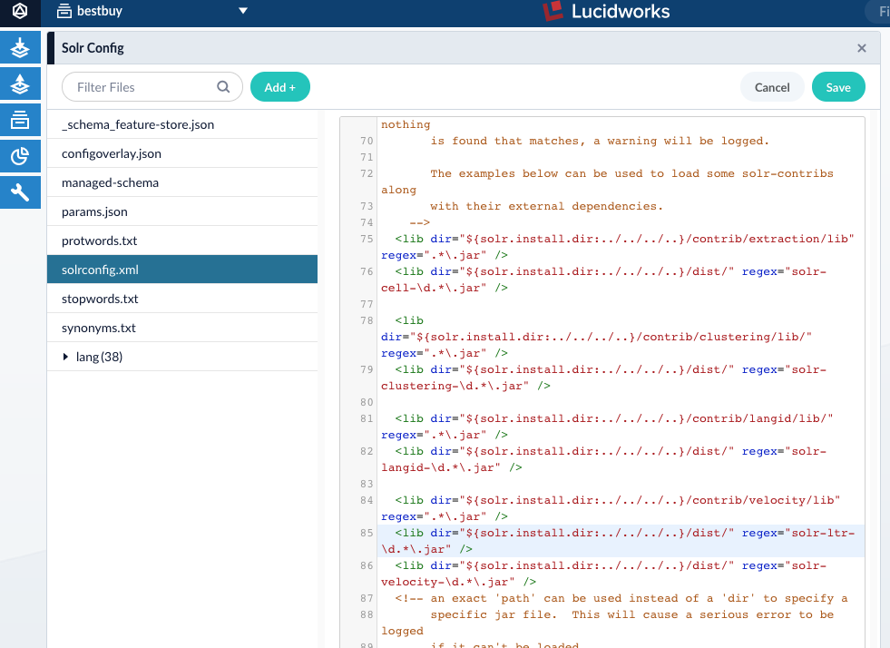
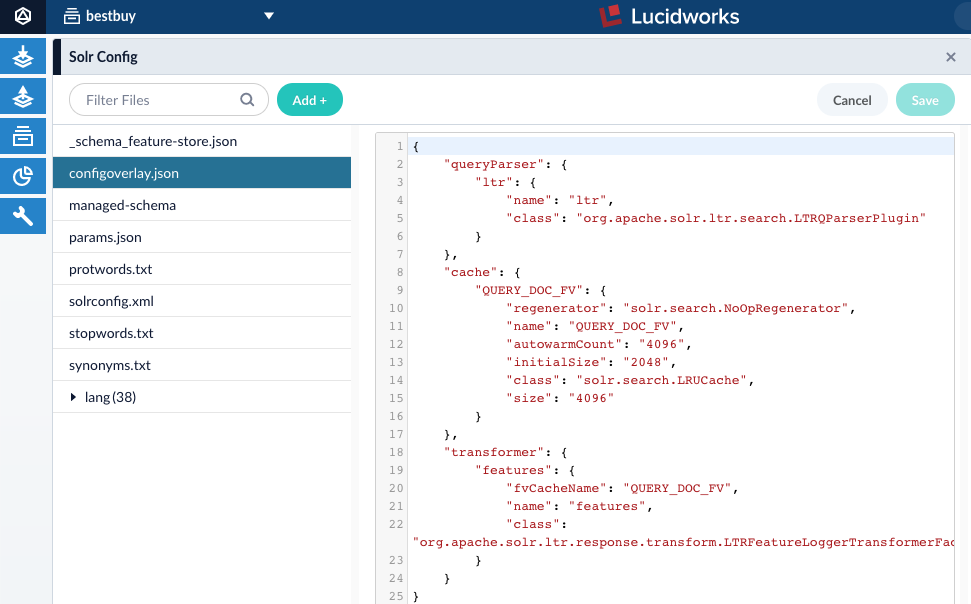
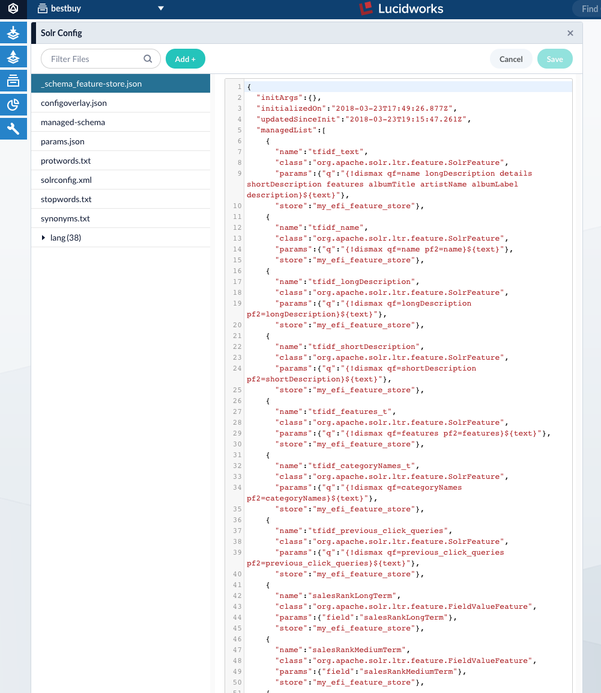
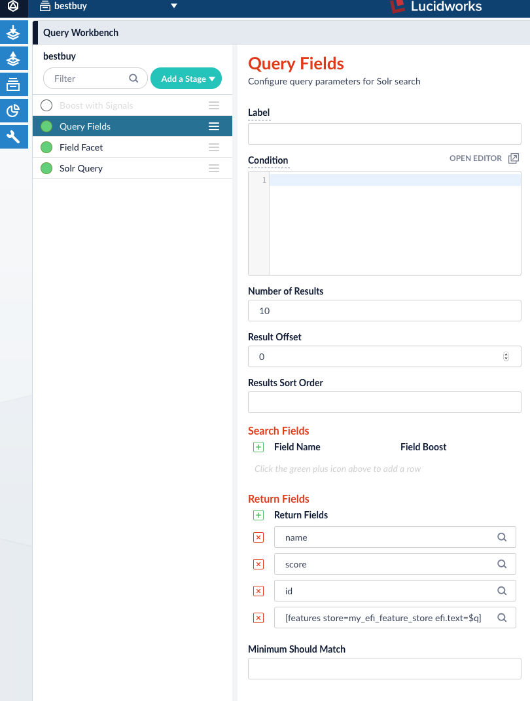
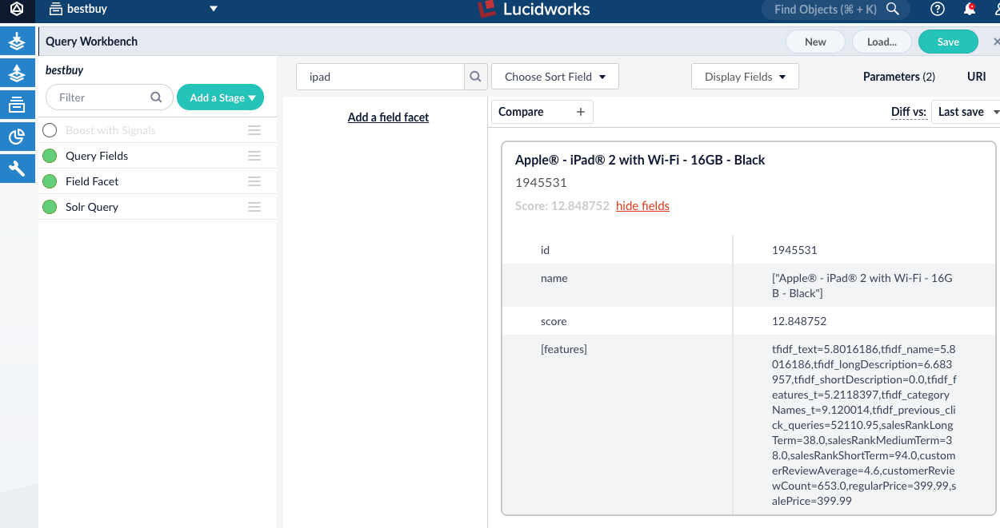
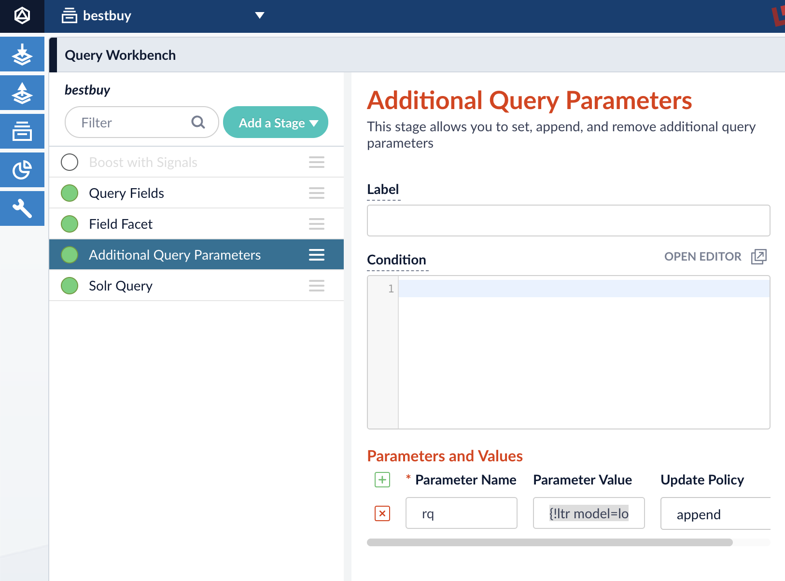

# Fusion 4.x + Solr LTR Walkthrough

## Prerequisites

* Fusion 4.x
* Python 2.7
* Set `FUSION_HOME` environment variable to local Fusion installation directory

## Instructions

### Fusion/Solr Setup

1. Enable LTR in Fusion:
    - In `$FUSION_HOME/conf/fusion.properties`, add `-Dsolr.ltr.enabled=true` under `solr.jvmOptions`
    - Restart Fusion
2. Create a new Fusion App called `bestbuy`, and index product catalog into Solr collection `bestbuy` and signals into Solr collection `bestbuy_signals`. Schema used for this walkthrough can be found in `schema.xml` in this repo
3. Enable LTR for `bestbuy` collection:
    - Update `solrconfig.xml` and add `<lib dir="${solr.install.dir:../../../..}/dist/" regex="solr-ltr-\d.*\.jar" />` directive.

    

    - Install `configoverlay.json`

    

4. Reload `bestbuy` collection

### Jupyter/Python Setup

1. Install pip dependencies: `pip install -r requirements.pip`
2. Launch Jupyter by running `fusion-jupyter` startup script.  This should launch Jupyter Lab in a browser window.  All notebooks have access to a Spark context (via `spark` variable) which connects to Fusion's Spark cluster.

### Index Data

1. Index Kaggle Bestbuy Dataset, see https://www.kaggle.com/c/acm-sf-chapter-hackathon-big
    - Product catalog should be indexed into `bestbuy` collection
    - User clicks (`train.csv` and `test.csv`) should be indexed into `bestbuy_signals` collection
2. Run [Data Setup.ipynb](./Data Setup.ipynb) notebook in Jupyter

### Add Features

1. Add `_schema_feature-store.json` file in Solr Config that contains contents of `features.json`:
    

### Setup Fusion Query Pipeline to output feature vectors

1. Open Query Workbench in Fusion Web UI
2. Load default Query Pipeline (`bestbuy`)
3. Disable "Boost with Signals" stage
4. In "Query Fields" stage, add this additional return field: `[features store=my_efi_feature_store efi.text=$q]`

    

5. Submit a test query and verify that a field called `[features]` is returned with every document

    

6. Save pipeline (Hit "Save" in the upper right hand corner)

### Execute LTR training pipeline

1. Update `constants.py` to reflect local environment
2. Run [Feature Extraction.ipynb](./Feature Extraction.ipynb)
3. Run [Train Model.ipynb](./Train Model.ipynb) -- This notebook will train a logistic regression model and upload the model to Solr

### Update Fusion Query Pipeline to enable query-time reranking using trained LTR model

1. Open Query Workbench in Fusion Web UI
2. Load default Query Pipeline (`bestbuy`)
3. Add "Additional Query Parameters" pipeline stage ordered before the "Solr Query" stage.  Add a parameter with Parameter Name=`rq` and Parameter Value=`{!ltr model=logit_001 reRankDocs=100 efi.text=$q}`

    

4. Submit a test query. To verify that LTR model reranking is active, select `View As: Debug` in the lower right and the explain output should reference `LinearModel`

    

5. Save pipeline (Hit "Save" in the upper right hand corner)
